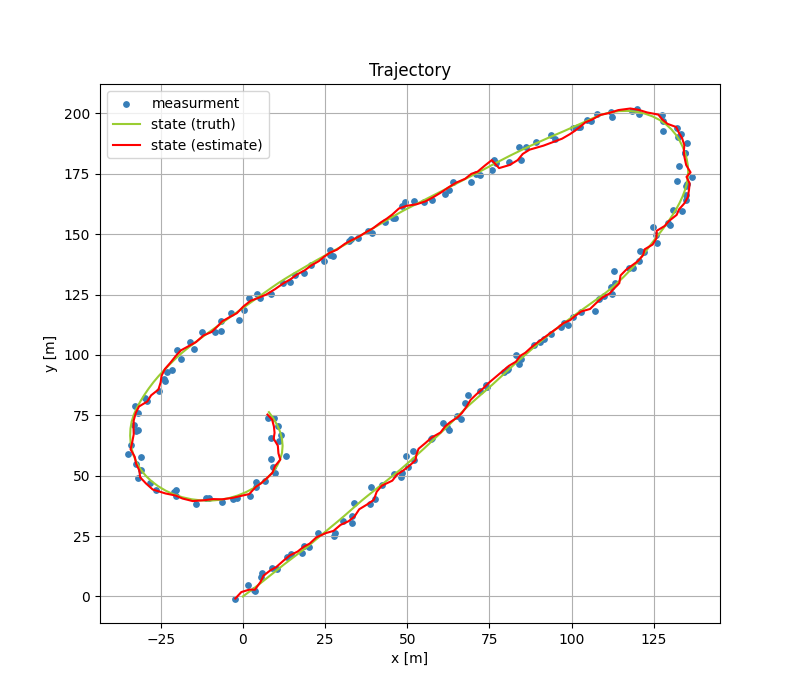

# IMM Filter 
An implementation of the interacting multiple model (IMM) filter in Python3.

<br>

## Kalman Filter
The IMM filter consists of multiple Kalman filters. Each Kalman filter is based on a model. We need to select a Kamlan filter depending on a type of the model, such as linearlity.

The implemented Kalman filters is as fllows.

* Linear Kalman Filter
* Extended Kalman Filter
* Unscented Kalman Filter

<br>

## Model


## Installaion
```sh
pip3 install pyyaml numpy scipy matplotlib
```
<br>

## Usage
* Prepare a configuration file  
  See cfg/sim1.yaml. It is an example of the configuration file.
<br>

* Execute

  ```sh
  python3 main.py --cfg cfg/sim1.yaml --output_dir result --seed 33
  ```
<br>

The estimation result is saved to the specified output directory.


When a model follows the constant velocity model, 
its mode value is zero. When a model follows the coordinated turn model, its mode value is one.

<br>

## References
1. Yaakov Bar-Shalom : Estimation with Applications to Tracking and Navigation, 1995.

2. Dan Simon : Optimal State Estimation: Kalman, H Infinity, and Nonlinear Approaches, 2006. 
